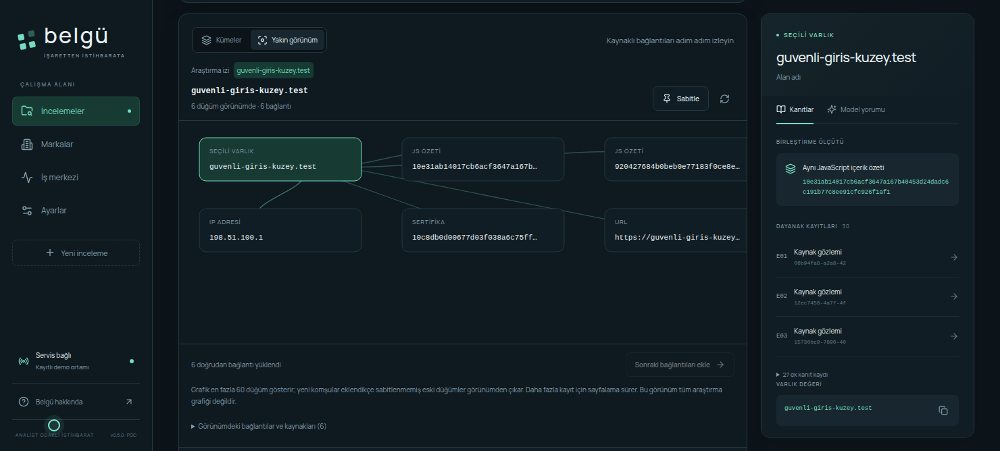

# Belgü

**Finans odaklı oltalama araştırmaları için analist çalışma alanı.**

Belgü, şüpheli bir URL veya alan adından başlayarak ilişkili altyapıyı, sayfa gözlemlerini ve önceki incelemelerdeki ortak izleri araştırmayı sağlar. Her bulgu kaynağı ve zamanıyla saklanır. Yerel bir model veya desteklenen bir bulut sağlayıcısı, bu kanıtlardan Türkçe analiz ve kaynaklı asistan yanıtları üretebilir.



[Ürün videosu · 2:16](docs/media/belgu-demo-v0.5.0.mp4) · [Türkçe altyazı](docs/media/belgu-demo-v0.5.0.srt) · [Kullanım kılavuzu](docs/user-guide.md)

Görseller ve video, örnek verilerle çalışan demo profilinden alınmıştır. Videodaki model yanıtları kayıtlıdır.

## Özellikler

- **Altyapı keşfi:** DNS, reverse-IP, sertifika şeffaflığı, mevcut urlscan kayıtları, sayfa ve JavaScript izleri.
- **Kanıt inceleme:** kapsam genelinde arama, filtreler, ilişkili varlık grafiği ve sıralanabilir kanıt panosu.
- **Görsel araştırma:** ayrı masaüstü/mobil yakalamaları, yerel OCR, marka referansıyla karşılaştırma ve görsel benzerlik sıralaması.
- **İnceleme hafızası:** önceki araştırmalardaki ortak izler, kaynak kayıtları ve analist kararları.
- **Model desteği:** kanıtlara atıf yapan Türkçe analiz ve kalıcı araştırma asistanı; yerel API, Claude, OpenAI, Gemini ve OpenRouter bağlantıları.
- **Takip ve raporlama:** keşif karşılaştırmaları, isteğe bağlı izleme, Markdown/JSON raporları ve maskelenebilen çevrimdışı HTML sunumları.

## Kurulum

Gereksinimler: **Linux**, **Python 3.12+**, **Node.js 22**, npm ve Git. Python kurulumu `venv` modülünü içermelidir. Ubuntu/Debian için sistem paketi komutları ve sorun giderme adımları [kurulum kılavuzundadır](docs/setup.md).

```bash
git clone https://github.com/yunusshin/belgu.git
cd belgu
bash scripts/setup.sh
bash scripts/run.sh demo
```

Sunucu başladıktan sonra aynı bilgisayardaki tarayıcıda `http://localhost:8765` adresini açın. Bu, kendi kurulumunuzun adresidir. Sunucuyu durdurmak için terminalde `Ctrl+C` kullanın.

Kurulum betiği Python/npm bağımlılıklarını ve Chromium'u indirir, sanal ortamı oluşturur ve arayüzü derler. **Model ağırlığı indirmez.** Demo profilini kullanmak için GPU, model sunucusu veya API anahtarı gerekmez; araştırma verileri ve model yanıtları örnek olarak sağlanır.

### Kendi incelemelerinizle çalışma

```bash
bash scripts/run.sh live
```

Sunucu başladıktan sonra `http://localhost:8766` adresini açın. **Ayarlar** bölümünden model ve araştırma kaynaklarını yapılandırın; ardından marka ve inceleme oluşturun. Bu profil, demodan ayrı bir veritabanı kullanır. Araştırma istekleri seçilen veri kaynaklarına; bulut modeli seçilmişse analiz metni ilgili model sağlayıcısına gönderilir.

Yerel model için çalışan bir API sunucusu gerekir. Donanım ihtiyacı seçilen modele bağlıdır. Model seçimi, desteklenen protokoller, API anahtarları ve veri saklama ayrıntıları [bağlantı kılavuzunda](docs/integrations.md) açıklanır.

## Belgeler

| Konu | Belge |
| --- | --- |
| Kurulum, güncelleme ve sorun giderme | [Kurulum](docs/setup.md) |
| İnceleme akışı ve araçlar | [Kullanım kılavuzu](docs/user-guide.md) |
| Model ve veri sağlayıcıları | [Bağlantılar](docs/integrations.md) |
| Bileşenler ve veri akışı | [Mimari](docs/architecture.md) |
| Testler ve model değerlendirmesi | [Test rehberi](docs/testing.md) |
| Yorumlama ve çalışma sınırları | [Bilinen sınırlar](docs/limitations.md) |
| Sürüm değişiklikleri | [Değişiklik günlüğü](CHANGELOG.md) |

## Kapsam

Belgü, tek analistin yerel ortamda kullanımı için geliştirilen bir POC'dir. Çok kullanıcılı kimlik doğrulama veya otomatik engelleme içermez. Ortak altyapı ve benzerlik puanları araştırma önceliği sağlar; tek başına zararlılık veya saldırgan atfı oluşturmaz. Model yorumları analist kararından ayrı tutulur.

## Lisans

[MIT](LICENSE) · Yunus Sahin. Uyarlanan keşif bileşenleri ve üçüncü taraf bildirimleri [NOTICE](NOTICE) ile [kaynak kökeni](docs/core-provenance.md) belgesinde belirtilmiştir.
