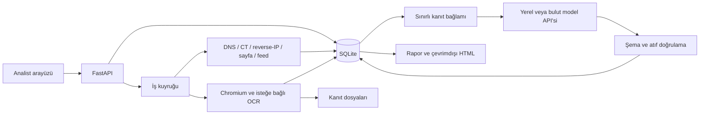

# Mimari

Belgü, React/TypeScript arayüzü, FastAPI uygulaması, SQLite veritabanı ve dosya tabanlı kanıt deposundan oluşur. API süreci yerel iş kuyruğunu da çalıştırır.

## Bileşenler

| Dizin | Sorumluluk |
| --- | --- |
| `src/belgu/core` | Sınırlı ağ toplama, kaynak bağdaştırıcıları, tarayıcı yakalama ve görsel benzerlik |
| `src/belgu/application` | İnceleme akışı, işler, hafıza, izleme, sıralama ve karşılaştırma |
| `src/belgu/analysis` | Kanıt seçimi, model protokolleri, prompt'lar ve çıktı doğrulama |
| `src/belgu/api` | HTTP uç noktaları ve sağlayıcı ayarları |
| `src/belgu/persistence` | Veri modelleri ve kalıcılık |
| `src/belgu/reporting` | Markdown/JSON ve çevrimdışı HTML çıktıları |
| `src/belgu/demo` | Kayıtlı örnek incelemeler ve sentetik görsel varlıklar |
| `web/src` | Analist arayüzü ve üretilmiş API tipleri |
| `tests`, `web/e2e`, `evals` | Otomatik kontroller ve model değerlendirme araçları |

## Kanıt modeli

Toplanan gözlem, model yorumu ve analist kararı ayrı kayıtlardır. Bir gözlem konusu, kaynağı, zamanları ve veri alanlarıyla saklanır. İlişkiler kanıt kimliklerine bağlıdır. Aynı konunun başka incelemede bulunması kayıtların sahipliğini değiştirmez.

Model analizi çağrı başındaki kanıt anlık görüntüsünü kullanır. Yeni gözlem toplandığında önceki analiz eski olarak işaretlenebilir. JSON şeması ve atıf kapsamı doğrulanır; kanıtların tamamı bağlama sığmadığında dışlanan kayıtlar sayılır.

## Profiller ve işler

Demo ve araştırma profilleri ayrı veritabanı ve kanıt dizinleri kullanır. Demo kayıtlı yanıtlar sunar; dış kaynak veya model servisini çağırmaz. Araştırma profilinde keşif, yakalama ve model işleri arka planda yürür. Tek worker nedeniyle uzun bir iş diğer işleri bekletebilir.

Zamanlanmış izleme aynı kuyruk üzerinde çalışır. Keşif ve görsel toplama süre, istek ve veri boyutu bütçeleriyle sınırlandırılır; kısmi sonuçlar ve hatalar korunur.

## Model ve bağlantı ayarları

Model sağlayıcısı ve keşif kaynakları `integrations.json` üzerinden yönetilir. Ayarlar değiştiğinde yeni işler yeni bağlantıyı kullanır; başlamış işler aldıkları bağlantı anlık görüntüsüyle tamamlanır. Analiz ve asistan aynı seçili sağlayıcıyı kullanır.

Yerel veya bulut API'lerine gönderilen bağlam metinseldir. Görsel benzerlik, modelden ayrı ve yerel bir hesaplamadır. Veri çıkışı ve anahtar saklama ayrıntıları [bağlantılar](integrations.md) belgesindedir.
