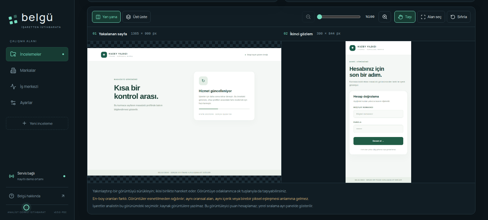

# Kullanım kılavuzu

## İnceleme oluşturma

Araştırma profilinde **Markalar** bölümünden marka adını ve referans alan adlarını tanımlayın. Marka referansı, kanıtların ilgili bağlamda değerlendirilmesine yardımcı olur; alan adının sahipliğini kendiliğinden doğrulamaz.

**Yeni inceleme** ile bir URL, alan adı veya IP ekleyin. Bildirim kaynağı ve notlar analist tarafından kaydedilir. Belgü'nün müşterilerin doğrudan veri girdiği ayrı bir portalı yoktur.

Keşfi başlatın; ilerleme, kaynak sonuçları, iptal ve kısmi tamamlanma bilgileri **İş merkezi** üzerinden izlenebilir. Eksik kaynak yanıtları önceki kayıtları silmez.

## Araştırma ve kanıt

Araştırma listesinde alan adı/IP/URL türü, gözlem zamanı, görsel kaydı ve ortak içerik izleriyle filtreleme yapılabilir. Filtreler bütün incelemeye uygulanır; sonuçlar daha sonra sayfalanır. Filtre görünümleri tarayıcıda inceleme bazında kaydedilir.

İlişki grafiğinde bir varlığa odaklanıp komşularını açın. İlişkiler, dayanak oluşturan kanıt kayıtlarına bağlıdır. Aynı IP, sertifika veya betik içeriği bir araştırma bağlantısıdır; tek başına ortak saldırgan anlamına gelmez.

Kanıt paneli kaynak, konu, gözlem zamanı, alınma zamanı ve kaydın alanlarını gösterir. En fazla 12 kanıt panoya sabitlenebilir ve sıralanabilir. Panodaki seçimler asistan bağlamı veya sunum için kullanılabilir.

## Görsel kanıt

**Görsel kanıt** bölümünde masaüstü, mobil veya iki profil için yakalama başlatın. İki profil ayrı işler ve ayrı gözlemler üretir. Son adres, HTTP sonucu, DOM metni, form alanları ve varsa OCR çıktısı görüntüyle birlikte saklanır.

Bir marka referansı yükleyerek ya da ikinci bir gözlem seçerek görüntüleri yan yana veya örtüşen görünümde inceleyin. Yakınlaştırma, kaydırma ve alan seçimi görüntülerin karşılaştırılmasını kolaylaştırır. **Yerel görsel sıralama**, algısal yapı, kenarlar ve renklerden bir benzerlik sırası üretir; ağ veya model çağrısı yapmaz.

Mobil profil Chromium emülasyonudur. Yakalama tek görünüm alanını içerir; kısıtlanan dinamik istekler nedeniyle sayfa tam görünmeyebilir. [Toplama sınırları](limitations.md).

## Adaylar, hafıza ve değişimler

- **Adaylar:** ortak altyapı ve içerik izlerini kaynaklarıyla birlikte önceliklendirir. Bir aday hedef olarak eklendiğinde kendi keşfi ve analizi yapılabilir.
- **İnceleme hafızası:** başka incelemelerdeki aynı hedefi veya ortak izleri, o incelemenin kanıtı ve analist kararıyla gösterir. Önceki kanıt kendi incelemesine aittir.
- **Değişimler:** iki keşifteki yeni, değişen ve yeniden gözlenmeyen kayıtları karşılaştırır. Yeniden gözlenmemek, hedefin silindiğini kanıtlamaz.

## Analiz ve araştırma asistanı

Model bağlantısını **Ayarlar** bölümünde seçin. **Model analizi**, gönderilmiş hedeflerin kanıtlarıyla Türkçe özet, gözlemler, hipotezler ve sonraki adımlar üretir. Kapsam dışında kalan veya bağlam bütçesine sığmayan kayıtların sayısı görünür. Her iddianın kaynaklarını açarak kontrol edin.

**Araştırma asistanı** bölümünde incelemeye ilişkin soru sorulabilir; örneğin “Önceki incelemelerle hangi izler ortak?” veya “Görsel kaydı olan adayları göster.” Konuşma ve yanıtın kaynak bağlamı kaydedilir. Önerilen filtre eylemleri araştırma görünümünü değiştirir; kendiliğinden yeni keşif başlatmaz.

Model görüntü piksellerini almaz; metin, DOM/form alanları ve OCR kullanır. Geçerli atıf ve JSON şeması, yorumun doğru olduğunu garanti etmez. Analist kararı ayrı kaydedilir.

## İzleme

İzleme hedefi ve aralığı açıkça seçilerek etkinleştirilir. Kontroller panelin API/worker süreci çalışırken yürür. Değişim, kaynak hatası ve yeniden veri alınması uygulama içi bildirimler üretir. Duraklatma sonraki kontrolleri durdurur; devam eden iş ayrıca iptal edilebilir.

## Rapor ve çevrimdışı paylaşım

İnceleme raporları Markdown/JSON olarak indirilebilir. **Paylaşım**, seçili kanıtlardan dondurulmuş bir sunum önizlemesi oluşturur. **Tekrar oynat**, inceleme kayıtlarını zaman çizgisi ve dayanak ilişkileriyle gösterir. Her iki araçta çevrimdışı HTML çıktısı alınabilir.

Maskeleme seçeneği açıkken dışa aktarılan sunum özgün hedef kimlikleri ve ham içerik yerine maskelenmiş alanlar kullanır. Açık içerik seçildiğinde rapor gerçek hedef ve kanıtları içerebilir. Önizlemeyi kontrol edin; dosya indirme herhangi bir platformda otomatik yayın yapmaz.
